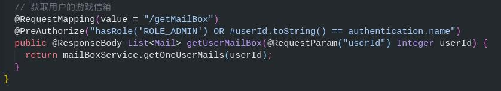

# Backend Server

This document aims to describe the building mechanics of the backend server for project CardGame.

**Table of Contents**

- [Technology Hub(技术栈)](#technology-hub技术栈)

- [Database Design](#database-design)

- [Unit Testing](#unit-testing)

  - [JUnit](#junit)

  - [Jacoco](#jacoco)

- [Security](#security)

  - [JWT](#jwt)

- [AWS Deployment](#aws-deployment)

- [API Design Logic](#api-design-logic)

  - [Pagination](#pagination)

---

## Technology Hub(技术栈)

> Database:
>
> - mysql + mongoDB
>
> ORM framework:
>
> - Spring Boot + maven
>
> Unit Testing:
>
> - JUnit4 + Jacoco Plugin
>
> Security:
> T
>
> - JWT + Spring Security
>
> AWS Deployment:
>
> - Amazon Web Services
>
> API Design Logic:
>
> - Based on [Google Cloud](https://cloud.google.com/apis/design)
>
> Other Tools:
>
> - PostMan (API)

---

## Database Design

- Basic Entities:

  - Activity, Card, Chapter, Enemy, Item, Mail, MailBox, Mission, MissionList, OwnCard, OwnItem, User

- Unimplemented:

  - FriendList, BlackList, ChatHistory

- Maintainence:

  - CrashReports, OnlineCountRecords, PveRecords, UserLoginRecord

- Requests:
  - AuthRequest -> Authentication Requests
  - ListRequest -> List Page(Pagination Requests)

---

## Unit Testing

Finished basic unit testing based on Junit4.

### JUnit

    Instead of testing the service or dao layer separately, we choose to use mockMvc to directly mock connection requests to test code for both controller logic(api related) and the other layers as well. We can therefore mimic http requests sent from users to better test our code as a whole.

    During the whole process we choose to use postman as a reference tool and JUnit4 as the testing tool.

    Major changes for unit testing in backend include modifications for the implementation of spring security and other changes for improvement of performance.

### Jacoco

    We use jacoco to generate code coverage reports.

    We've covered all the code aside from the unimplemented entities and the entities tested from the maintainence side.

---

## Security

    Basic implementation of spring security + JWT.

### JWT

**Basic Login**

    We use JWT's authorization token as the basis of our project's security mechanism.

    The general idea would be that we only allow requests to the login end and the register end for our project.

    And then after we receive a login request and confirm with the user data in the database that the user is qualified for access, we send a response with the user's data and a token for further authorization.

    For further requests, the user/client-end has to add an Authorization header with the token it accquired from successfully logging in.

    The backend server detects such a token and will not grant access if token doesn't exist.

**Roles**

    Although we have a protection mechanism to protect non-users to access the whole project, we still don't have a protection mechanism to prevent users from accessing other user's information, or preventing users to access endpoint built for admins or the maintainence side.

    Therefore we added roles to differentiate users and admins.
    Users should only access user accessable endpoints.
    While Admins have access to all endpoints.

    After adding roles, we also need to make sure that when users send user accessable requests, they are attempting to modify **their own** information.

    Before: Users and admins can access all information.
    Now: User can only access client endpoints and can only modify their own information.

---

## AWS Deployment

During the earlier stage of development we deployed the backend in the server located in the US, during the stage for performance tuning we redeployed it to Seoul Korea for better performance.

Nevertheless, the environment for both servers are the same.

**Server Information**

    Operating System: Ubuntu 16.04.6 LTS

    Kernel: Linux 4.4.0-1109-aws

    Architecture: x86-64

    Environment for backend: mongodb, mysql, java installation.

---

## API Design Logic

The whole project generally sticks to the basic rules of google cloud api design.

### Pagination

    After the first deployment, we realized that the getAll api that we originally designed does not statisfy actual needs.

    Therefore, we designed a new Pagination API for all controllers.

    An example:

    ListRequest sends the page number of the requested page and the API will return the requested page data and a next page token, the token will be empty if the requested page is the last page available.
